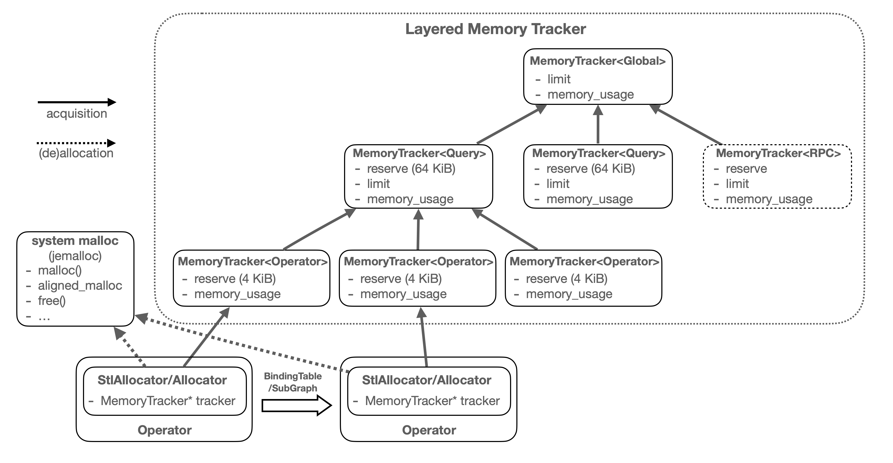
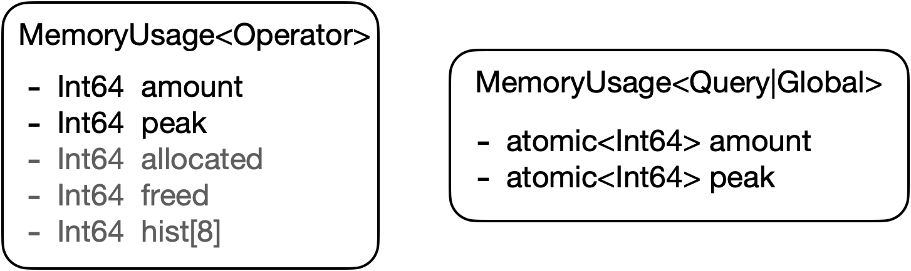
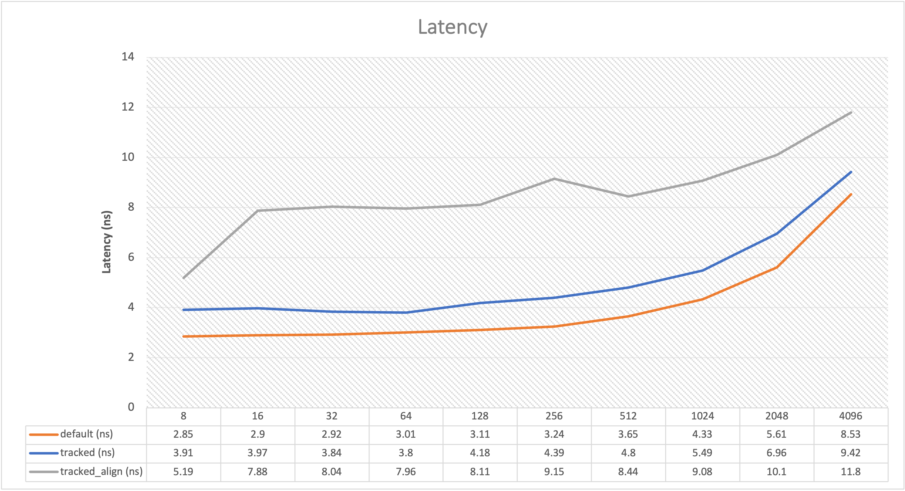
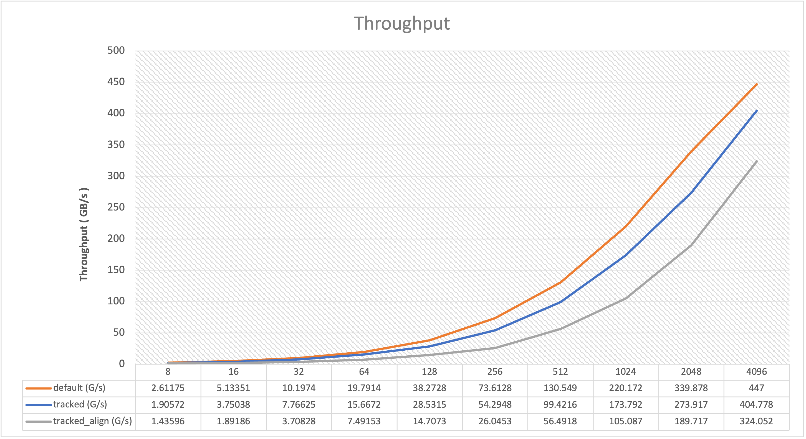

# Memory Management

This document describe nebula's memory management design choice made to balance efficiency and functionality.

## 1. Memory Tracker

A memory tracker is responsible to track memory resource used by components of database management system,
the trackability added into the system, make memory quota management and detailed memory profiling possible.

- Typical memory heavily used component includes:
    - Execution Runtime (operators, e.g. Join, Aggregate, Sort);
    - Network RPC (de)serialize (unimplemented);
    - Storage buffer pool, e.g. rocksdb block cache (unimplemented)

### 1.1 Layered Memory Tracker

Memory hierarchy is layered due to the nature hierarchical architecture of the core component involved during executing
a query.

- Layer Definition
    - MemoryTracker\<Global\>: singleton global scope;
        - has no parent
        - has no reserve
        - has limit set from configuration or system memory monitor
    - MemoryTracker\<Query\>: query scope
        - has MemoryTracker\<Global\> as parent
        - has max reserve size of 64 KiB
        - has limit set during query execution, set from session configuration, or parameters of corresponding query
    - MemoryTracker\<Operator\>: operator scope
        - has MemoryTracker\<Query\> as parent
        - has max reserve size of 4 KiB
        - no limit size

  > **Note** May add more layer in the future when needed, like `user layer`, `database layer`, `rpc layer` etc.

- What is `reserve`?
    - Child memory tracker need report usage to parent, if child report to parent on every allocation, parent
      tracker's usage counter can easily become a bottleneck;
    - Each child memory tracker reserve some memory quota by itself;
        - Each time alloc call occurs, it first tries to get request size from reserve; if locally reserved satisfy
          the size, it minus the size from reserve, otherwise it get another reservation from parent;
        - Each time dealloc call occurs, it first adds the request size to reserve; if locally reserved size does not
          exceed max reserve size, it does not trigger parent release; otherwise it return max reserve size to parent,
          hold the rest as locally reservation;
    - Different layer has different max reserve size
        - Larger reserve size trigger less parent alloc, but may cause small query's waste quota;

### 1.2 Memory Usage

Different layers' memory tracker has different memory usage definition, for following reasons:

- thread access: MemoryUsage\<Operator\> only used in single-thread scenario, while upper layer trackers always used in
  multi-thread scenario;
- detailed alloc metrics: in DEBUG build, usage for operator record total allocate & free memory, as well as alloc size
  histogram, helping check if memory allocation act as expected.

- MemoryUsage\<Operator\>
    - `amount`: current consumed memory
    - `peak`: max consumed memory in history
    - `allocated`(debug): total allocated memory
    - `freed`(debug): total freed memory
    - `hist`(debug): allocate size distribution in histgram in
      bucket [0,32][32,128][128,512][512,1k][1k,4k][4k,32k][32k, +]

  > **Note** only single thread will access it, all counter are int64;
  
- MemoryUsage\<Global | Query\>
    - `amount`: atomic, current consumed memory
    - `peak`: atomic, max consumed memory in history

  > **Note** all counter is atomic to guarantee thread-safe, may access by multiple thread from child;

## 2. Allocators

Defined two types of allocator

- both allocators warp a memory tracker pointer, which track bytes allocated from them;
- both route to allocation system malloc (e.g. jemalloc), allocators does not cache any memory (malloc should take care
  of it);

### 2.1 Allocator

General allocator, intend to be used in memory table.

### 2.2 StlAllocator

Stl compatible Allocator, current BindingTable use a lot of STL structures, this allocator is a drop-in replacement for
stl allocator.

## 3. Benchmark

- Detailed benchmark reference
  to [benchmark](https://github.com/codesigner/nebula-ng/blob/images/src/common/images/test/MemoryBenchmark.MD)

### 3.1 Source Code

[MemoryTrackerBenchmark.cpp](https://github.com/codesigner/nebula-ng/blob/images/src/common/images/test/MemoryTrackerBenchmark.cpp)

### 3.2 Measurement

- Compare allocation size from 8b to 4kb;
- Operation unit was measured using one alloc + one free in specified byte size;
- Compare target
    - default: default system malloc/free call, without NULL check
    - tracked: tracker enabled Allocator's allocate/deallocate,
      see: [Allocator.h](https://github.com/codesigner/nebula-ng/blob/images/src/common/images/Allocator.h)
    - tracked_align: tracker enabled Allocator's aligned allocate/deallocate,
      see: [Allocator.h](https://github.com/codesigner/nebula-ng/blob/images/src/common/images/Allocator.h)

Some conclusions:

- Latency
    - With memory tracker added to the allocation code path, it slows down 1 ns generally;
    - tracked_align double the latency, use it when we do need it, e.g. SIMD need more alignment control over memory;

- Throughput:
    - for default and tracked, throughput reach memory bandwidth when alloc size > 256;
    - tracked_align, throughput reach memory bandwidth when alloc size > 512;

> **Note**: the allocated bytes was not access, only the malloc()/free() functions was benchmarked, if we access that
> memory, the real throughput should lower, and will hit a maximum throughput according to specific hardware;
