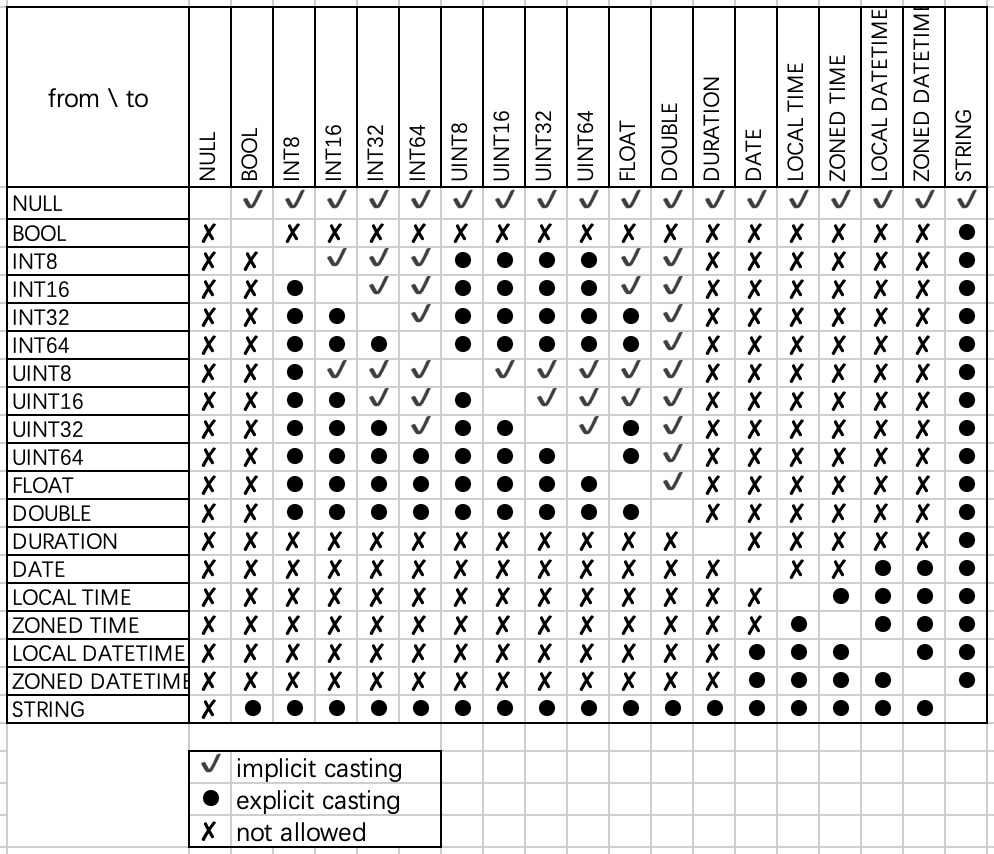

## Type Casting Rules
Reference: GQL-2023.12, 20.8 <cast specification>

### Plain types

The following matrix describes which conversions are supported. When implicit casting is allowed, it implies that explicit casting is also allowed.

NOTE: Implicit casting may result in loss of precision. (INT64/UINT64 → DOUBLE)

### Nested types

#### List
It's allowed if and only if the source list element type can cast to the target list element type

#### Record
It's allowed if and only if the source and target record type have the **same** set of field names, and every field type of source record type can cast to the corresponding field type of target record type.

#### Node/Edge
It's allowed if and only if the set of property names of source node/edge type is a **subset** of target’s, and every property type of source node/edge type can cast to the corresponding property type of the target node/edge type.

#### Path
It's allowed if and only if every node/edge type of source path type can cast to at least one node/edge type of the target path type.

## When does implicit casting happen?

Scenarios:
1. In function expression, if the input argument type is not same as the declared parameter type, we will try to cast the input to the declared type.
2. In list expression, if the input types are not same, we will try to cast the inputs to their combined type and use it as list element type.
3. In case/when expression, if the types of then/else branches are not same, we will try to cast them to the combined type, same as list expression.
4. In union operator, if the input types of same output column are not same, we will try to cast them to the combined type. 
5. In insert/set statement, if the data type is not same as schema, we will try to cast it to the declared type in schema.
6. In call procedure statement, if the input argument type is not same as the declared parameter type, we will try to cast the input to the declared type.

In one word, we will do implicit casting if it is needed.

NOTE: We use “try to cast” in the above paragraph, which means that if the implicit casting is not allowed, an error will be reported (at validation phase).